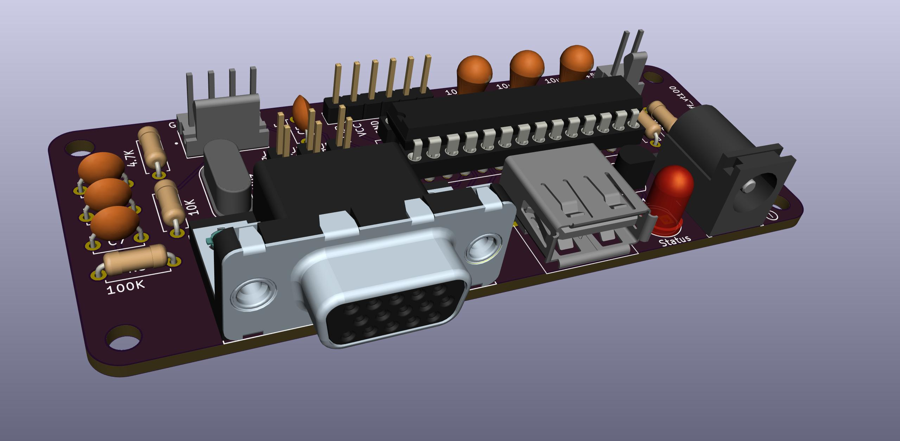
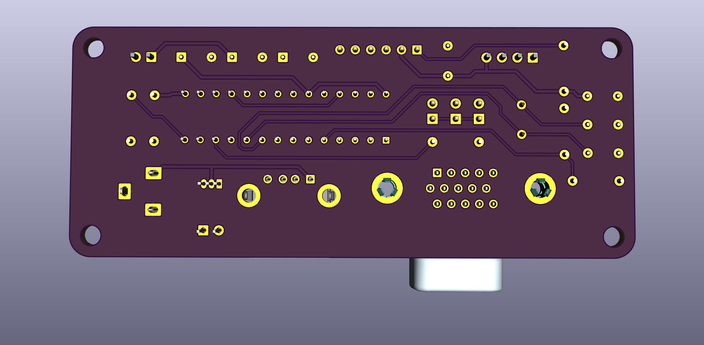

# Geoff's VT100 Terminal  
  
  

PCB from OSHPark: <https://oshpark.com/shared_projects/5vfXm2rY>  
Parts from Digi-Key: <https://www.digikey.com/short/zrdw9v>

## Credits  
This version aims to combine elements from the following other versions:  

* [Geoff Graham](https://geoffg.net/terminal.html)  
 The original version  
* [Peter Hizalev](https://github.com/petrohi/terminal)  
 "v2.0" with rearranged PCB and modified firmware  
* [David Hansel](https://github.com/dhansel/TerminalUSB)   
 USB keyboard instead of PS/2  

## Goal  
Changes in this version:
 - remove ps/2 port
 - change usb port to type-a female
 - barrel power jack
 - remove all GND traces
 - add copper pours for GND on both sides
 - optimize routes, increase clearances, and tweak footprints to get full copper pour coverage  
 - DigiKey BOM  
 - Fully self-contained KiCAD files  

## Status  
 PCB: done but not tested  
  need to clean out un-used components and models  
  need to include a few more symbols & footprints  

 Firmware: has not been touched at all yet. Firmware probably does not work currently, as it is just a copy of Peter Hizalev's firmware, but the PCB no longer matches that PCB.  
  Peter Hizalev PCB uses a 20mhz crystal, which this PCB has  
  This PCB started from Peter's, so if the firmware requires any other hardware differences, like different pinout to the mcu, this board should match  
  Peter Hizalev firmware expects keyboard on PS/2, which this PCB does not have  

 TODO:  
  Generate diffs between the 3 source versions above to understand the changes each made vs the original  
  Combine Peter Hizalev and David Hansel changes  
 
